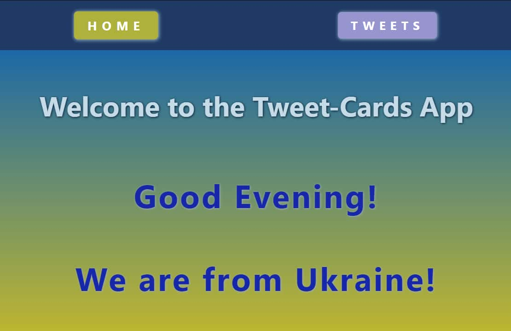
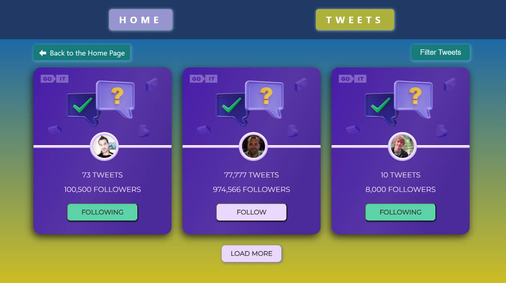

# Tweet-Cards App

---

## Screenshots

## Description

Tweet-Cards App it's a single-page application built on React.js and uses
routing to navigate through pages.

This app has the following functionality:

- interactivity when clicking on the follow button;
- filtering users by 3 criteria;
- return to the home page when clicking on the Back button;
- additional loading of users by clicking on the button Load More;
- smooth scrolling to the top of the page.

## Technologies

- React
- Redux
- React Router
- JavaScript
- HTML
- CSS
